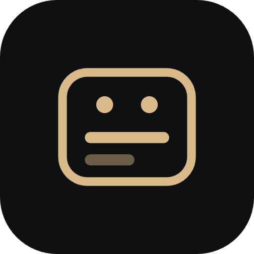

<h1 align="center">
  
  legendarr
</h1>

## About

Self-hosted companion for **Radarr** and **Sonarr** that automatically translates
subtitles, with flexible language profiles and the ability to translate any subtitle,
including tracks embedded inside the video.

Full documentation: **[andersonviudes.github.io/legendarr](https://andersonviudes.github.io/legendarr/)**.

## Features

- [Language Profiles](https://andersonviudes.github.io/legendarr/features/language-profiles/) —
  named source/target language and translation-preference sets, e.g. "translate embedded
  Japanese to `pt-BR` and `en` for anime".
- [Media Library Sync](https://andersonviudes.github.io/legendarr/features/media-library/) —
  keeps track of every movie and series in your Radarr/Sonarr library on a background schedule.
- [Subtitle Discovery](https://andersonviudes.github.io/legendarr/features/subtitle-discovery/) —
  finds every subtitle a video already has, external or embedded.
- [Subtitle Acquisition](https://andersonviudes.github.io/legendarr/features/subtitle-acquisition/) —
  downloads subtitles from your configured provider sites when none exist yet.
- [Subtitle Translation](https://andersonviudes.github.io/legendarr/features/subtitle-translation/) —
  pluggable translation backends behind a single provider interface.
- [Subtitle Timing Sync](https://andersonviudes.github.io/legendarr/features/subtitle-timing-sync/) —
  re-aligns a subtitle's cues against the video with `ffsubsync`.
- [Authentication](https://andersonviudes.github.io/legendarr/features/authentication/) —
  optional single-admin login for self-hosted deployments.
- [External API](https://andersonviudes.github.io/legendarr/features/external-api/) —
  the same REST API the dashboard uses, documented for scripts and other tools.
- [Media-Server Integration](https://andersonviudes.github.io/legendarr/features/media-server-integration/) —
  notifies Plex/Jellyfin automatically after a subtitle is written.
- [Internationalization](https://andersonviudes.github.io/legendarr/features/internationalization/) —
  pick your own UI language from Settings.
- [Backup & Restore](https://andersonviudes.github.io/legendarr/features/backup-restore/) —
  snapshot legendarr's configuration before an upgrade or a move to a new host.

## License

Licensed under the [GNU General Public License v3.0](LICENSE) or later.
