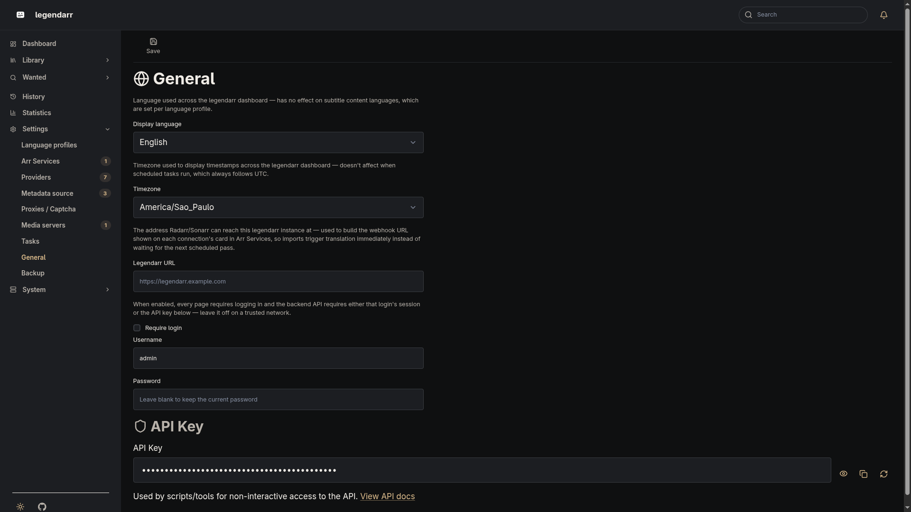

# Authentication

*ROADMAP.md 0.16.0 — legendarr is a single-tenant, self-hosted app: one shared admin
login, not a multi-user system, off by default so existing installs and a trusted LAN
deployment are unaffected until an admin opts in from Settings.*

## Enabling login

Settings → General (`/settings/general/`) has one toggle — "Require
login" — plus a username and password. Enabling it requires both to already be set or
provided in the same save; `manage_authentication.update_auth_settings` rejects an
`enabled=True` update that would leave the account without a resolvable username and
password, since that would lock every login out with no way back short of editing
`config.yaml` by hand. The password is hashed with PBKDF2-HMAC-SHA256
(`authentication/passwords.py`, stdlib `hashlib`, no extra dependency) before being
stored in `config.yaml` — never in plaintext, and never re-displayed once saved.

## What gets gated

Two independent layers, both driven by the same `auth_enabled` flag:

- **The web UI.** A single FastAPI dependency (`legendarr_web.authentication.session_guard
  .require_authenticated_session`) is registered once, app-wide, in `legendarr_web/app.py`
  — it applies to every included router automatically, so a new page never needs to
  remember to add it. An unauthenticated visitor is redirected to `/login` (a `303` for a
  normal page load, an `HX-Redirect` for an HTMX request, so a partial swap doesn't render
  a login form inside a content div). `/login` and `/logout` are the only exempt paths.
- **The backend API.** A second app-wide dependency
  (`legendarr_backend.authentication.api_guard.require_api_access`) gates
  `legendarr_backend`'s `api_app`. A request is allowed if it carries either a valid
  `X-Api-Key` header (for scripts — the same key shown in Settings, see the [External
  API](external-api.md)) or a valid `X-Legendarr-Session` header (forwarded automatically by
  `legendarr_web`'s `get_backend_client` on every call, so a logged-in browser session
  authorizes the backend calls made on its behalf without a second shared secret between
  the two processes). `/webhooks/*` is exempt — Radarr/Sonarr's "Connect" calls can't send
  any header, the same unauthenticated-by-design contract documented on
  `media_library/webhooks.py`'s own route — along with `/auth/login`, `/auth/logout`, and
  `/auth/sessions/validate`, the bootstrap trio a caller can't already hold credentials to
  reach.

## Sessions

A successful login creates an `AuthSession` row and hands the browser an opaque token in
an `HttpOnly` cookie (`legendarr_session`). Only a SHA-256 hash of that token is
persisted — never the raw value. A session slides forward 30 days from its last use each
time `/auth/sessions/validate` runs (once per page navigation); it's fixed, not
configurable from Settings.

System → Sessions (`/system/sessions/`) lists every active session — device, IP address,
login time, last-seen time — flags the viewer's own session as "This device", and can
revoke any other session individually or all of them at once.

## API key

Settings → General also shows a generated API key (`secrets.token_urlsafe(32)`),
stored encrypted at rest the same way as `radarr_api_key`/`sonarr_api_key`
(`security/fernet.py`), masked by default with a reveal toggle and a copy button since
it's a credential the admin needs to retrieve, not one they chose. "Regenerate"
invalidates the old key immediately. It's the credential for the [External
API](external-api.md) (ROADMAP.md 0.17.0) — the intended non-interactive surface for it.
