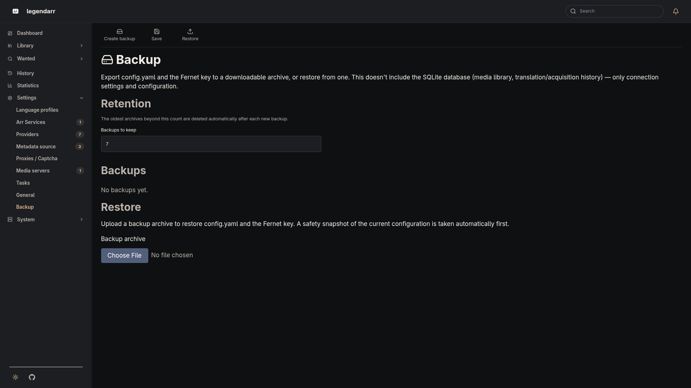

# Backup & Restore

*ROADMAP.md 0.22.0 — lets an admin snapshot legendarr's configuration before an upgrade,
or move it to a new host, from the Settings page. Scoped to configuration only: it
doesn't cover the SQLite database (media library, language profiles, translation/
acquisition history, statistics) — see [Scope](#scope) below.*

## What's in a backup

Settings → Backup (`/settings/backup/`) creates a downloadable `.zip` archive containing:

- `config.yaml` — Radarr/Sonarr connection, task/translation/webhook settings,
  authentication config, UI locale. Already encrypted at rest (`*_api_key`,
  `auth_password_hash`), so the archive carries the same ciphertext that's on disk.
- `.secret_key`, the Fernet key used to encrypt those fields — included only when it's
  actually a file in the data directory. If `LEGENDARR_SECRET_KEY` is set, the key lives
  in the environment instead, and the archive omits it (there's nothing on disk to copy).
- `manifest.json` — when the archive was created, and whether the key was bundled.

## Scope

Backups don't include the SQLite database. Restoring on a new host brings back
connection settings and configuration, not the media library, language profiles, or
translation/acquisition history — those stay wherever the database file lives.

## Retention

The Backup page has one setting, "Backups to keep" (`backup_retention_count`, default
`7`, also settable via `LEGENDARR_BACKUP_RETENTION_COUNT`). After each new backup —
including the automatic pre-restore snapshot below — the oldest archives beyond that
count are deleted.

## Restoring

Uploading an archive on the Backup page:

1. Validates it — a legendarr backup has a readable `manifest.json` and a `config.yaml`
   that passes the same validation as the live file, and the Fernet key must actually be
   present if the manifest says it was bundled. An invalid archive is rejected with no
   changes made.
2. Takes one ordinary backup of the *current* configuration first, so a bad restore can
   itself be undone from the list.
3. Overwrites `config.yaml` (and `.secret_key`, if bundled) in the data directory.

Restoring doesn't restart legendarr for you — `config.yaml`, the Fernet cipher, and the
scheduler are all read once into process memory, and safely reloading all of that live is
out of scope here. The Backup page tells you to restart the process/container once the
files are written; the restored configuration takes effect on that next start.

**Moving to a new host:** if the original install used the auto-generated key file
(the common case), set `LEGENDARR_SECRET_KEY` to that key's value on the new host before
restoring, or the encrypted fields in the restored `config.yaml` won't decrypt — see the
[environment variables reference](../configuration/environment-variables.md) for how to
generate/read one.
