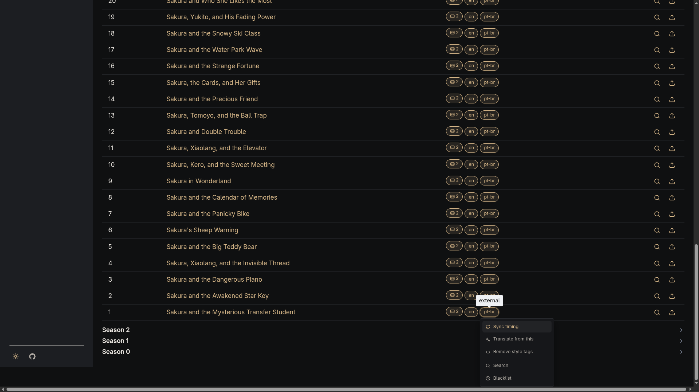

# Subtitle Timing Sync

Any subtitle already on disk — discovered externally, extracted from an embedded track, or
produced by [translation](subtitle-translation.md) — can drift out of sync with the video's
audio. `sync_subtitle_timing()` re-aligns one subtitle's cues against the video, via
`ffsubsync`.

## Two sync modes

`ffsubsync` accepts either a video (it decodes the audio track) or another already-correctly-
timed subtitle file as its reference — `sync_subtitle_timing()` is agnostic to which, and just
forwards whatever `reference_path` it's given. Clicking a subtitle's "Sync timing" action opens
a dialog with both options: sync against the video's audio (the only mode before this), or
pick another subtitle already on the same file to sync against instead.

## Manual, per-subtitle trigger

Unlike translation, this isn't run automatically as part of any pipeline. Each subtitle row
in a movie/series detail page gets its own "Sync timing" action, which enqueues a one-off job
for that single `Subtitle` once a mode is picked from the dialog. There's no bulk fan-out and
no scheduled interval — the same manual-only posture translation had before unattended
scheduling (0.10.0) existed.

## Overwrite behavior

`ffsubsync` writes to a temporary sibling file first, and the target `.srt` is only replaced
once it exits successfully — a killed or timed-out run never leaves a partial file behind.
The overwrite is always in place: there's no backup of the pre-sync file, and no way to undo
a sync from the UI.

A missing `ffsubsync`/`ffmpeg` binary, a non-zero exit, or a timeout are all treated as an
expected "couldn't sync this one" outcome — logged and reported back to the UI as a failure,
not raised as an error.
