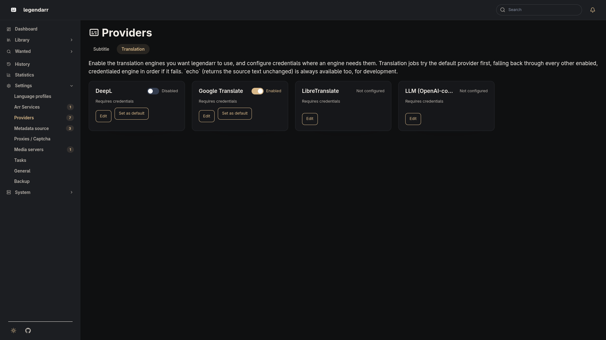

# Subtitle Translation

Translation backends implement a single `TranslationProvider` protocol:

```python
class TranslationProvider(Protocol):
    name: str

    def translate_batch(
        self, texts: list[str], source_language: str, target_language: str
    ) -> list[str]: ...
```

Every subtitle is translated in one call — every line goes out together and comes back in
the same order — instead of one request per line. This keeps the translation step decoupled
from whichever service does the actual work.

## Built-in providers

| Provider | Description |
| --- | --- |
| `echo` | Returns the input unchanged. Used for local development and tests. |
| `deepl` | [DeepL](https://www.deepl.com/) — needs an API Key. Free-tier (`:fx`-suffixed) keys are routed to the free-tier host automatically. |
| `google` | Google Cloud Translation (v2) — needs an API Key. |
| `libretranslate` | [LibreTranslate](https://libretranslate.com/) — self-hosted, needs an Endpoint URL; an API Key is only required by instances that opt into one. |
| `llm` | Any OpenAI-compatible `/chat/completions` API — OpenAI itself, or a self-hosted/third-party endpoint that speaks the same protocol (Ollama, LM Studio, OpenRouter, Groq, ...). Needs an API Key; Endpoint and Model both default (to `https://api.openai.com/v1` and `gpt-4o-mini`) when left blank. |



`deepl`, `google`, `libretranslate`, and `llm` are registered and credentialed from
`/settings/translation-providers/`: enable the ones you want, fill in whichever credential
fields they need, and use "Test connection" to confirm they're reachable before relying on
them. `echo` needs no credentials and is always available, for development.

## Provider selection

Provider selection is a **global** setting, not a per-[language profile](language-profiles.md)
field — a `LanguageProfile` only says which languages to translate into, not which engine to
use. From `/settings/translation-providers/`, one enabled and credentialed provider can be
marked the default. A translation job tries the default first, then falls through every other
enabled, credentialed provider in `id` order if the default fails or isn't set — so a job never
fails outright just because one engine is briefly unavailable, as long as another is configured.

## Custom prompt for the `llm` provider

The `llm` provider's edit form has a **Prompt Template** field — leave it blank to use the
built-in prompt, or supply your own to tune tone, terminology, or instructions for a specific
model. A custom template must use the same three placeholders the built-in prompt does:

| Placeholder | Meaning |
| --- | --- |
| `{source}` | Source language code (e.g. `en`) |
| `{target}` | Target language code (e.g. `pt-BR`) |
| `{count}` | Number of subtitle lines in the batch |

A literal `{` or `}` in the prompt text itself needs to be doubled (`{{`/`}}`) so it isn't read
as a placeholder. The template is validated when you save it — an unknown placeholder is
rejected with an error instead of silently breaking the next translation run. Only the system
prompt is customizable; the request payload shape and the expected
`{"translations": [...]}` response format are fixed.

## Plugins (third-party providers)

A translation engine legendarr doesn't ship built in can be added as a plugin, without
recompiling or redeploying legendarr itself. A plugin is a Python class implementing the
`TranslationProvider` protocol above, plus a bit of catalog metadata:

```python
class MyTranslationProvider:
    kind = "my-provider"                      # must not collide with a built-in kind
    label = "My Provider"                      # display name in the web UI
    name = "my-provider"                        # TranslationProvider.name
    credential_fields = ("api_key", "endpoint")  # subset of: api_key, endpoint, model, prompt_template
    required_credential_fields = ("api_key",)    # subset of credential_fields required for "has credentials"
    plugin_api_version = 1                       # checked against legendarr's supported version

    def __init__(self, config: TranslationProviderConfig) -> None: ...
    def translate_batch(self, texts, source_language, target_language) -> list[str]: ...

    # Optional — backs the "Test connection" button. A plugin without one gets a
    # generic "configuration saved" result instead.
    @staticmethod
    def test_connection(config: TranslationProviderConfig) -> tuple[bool, str]: ...
```

A plugin can only use the four existing config fields above (`api_key`, `endpoint`, `model`,
`prompt_template`) — there's no free-form/arbitrary config, so a plugin never needs its own
database migration.

Point legendarr at the plugin with `LEGENDARR_TRANSLATION_PLUGIN_PACKAGES` — a comma-separated
list of `module.path:ClassName` entries, e.g.:

```env
LEGENDARR_TRANSLATION_PLUGIN_PACKAGES=my_package.provider:MyTranslationProvider
```

The plugin's package needs to already be installed in the container (build a custom image
`FROM` the legendarr image with an extra `pip install` layer, or mount it onto `PYTHONPATH`) —
legendarr only imports what's already reachable, it doesn't fetch packages at runtime.

Plugin loading never blocks startup: an entry that's malformed, unimportable, missing required
metadata, declares an incompatible `plugin_api_version`, or whose `kind` collides with a
built-in provider or another plugin is skipped and logged, and every other provider (built-in
or plugin) still loads normally. The plugin list is read once at process startup — adding or
removing an entry needs a container restart, and it isn't editable from the web UI, since it's
a code-import path rather than an ordinary runtime setting.
